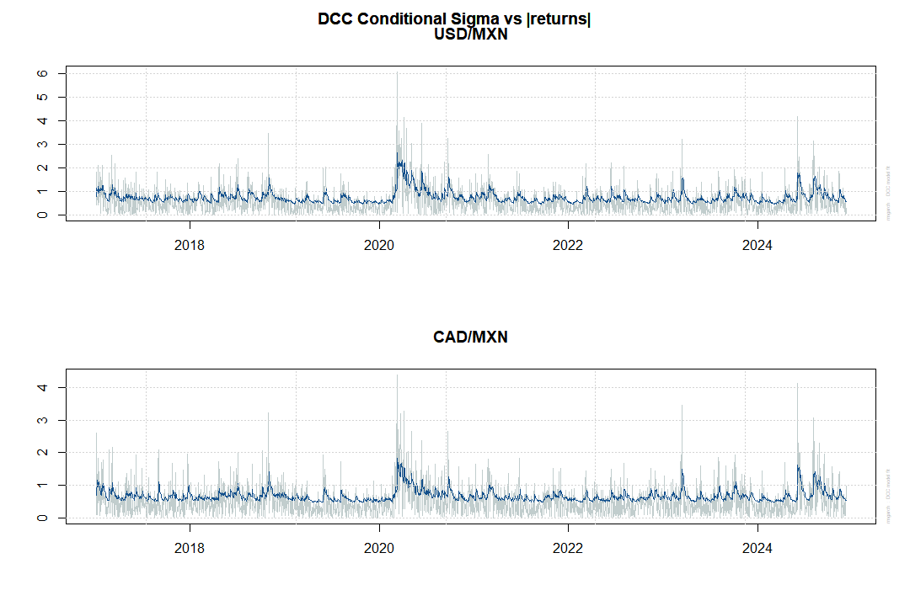
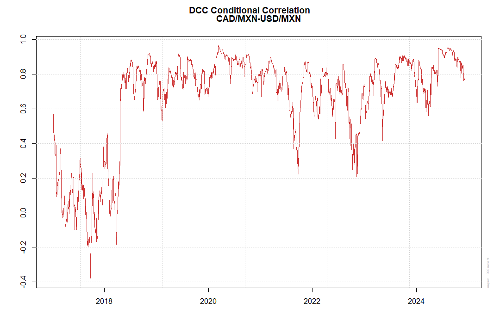

# Modelado de la volatilidad del Bitcoin y análisis multivariado del tipo de cambio (USD y CAD frente al MXN)

Este proyecto muestra la parte teórica y práctica de los modelos aplicados a series de tiempo con heterocedasticidad, es decir, cuando la variabilidad de los errores (o residuos) no es constante a lo largo del tiempo.

## Problemas
- Comprobar que la volatilidad del Bitcoin es heterocedástica y modelarla.
- Analizar la heterocedasticidad en la volatilidad del dólar estadounidense (USD) y del dólar canadiense (CAD) frente al peso mexicano (MXN), y modelar estas series de manera multivariada para estudiar su relación mutua y el grado de dependencia entre ellas.

## Enfoque de solución
- Se emplean modelos **ARCH** y **GARCH** para capturar la heterocedasticidad de la volatilidad del Bitcoin.  
- Para el caso multivariado, se utilizan modelos **GARCH multivariados**, en particular el **DCC-GARCH**, que permite que las correlaciones entre series cambien dinámicamente en el tiempo.

## Resultados
Los modelos ajustados muestran un desempeño satisfactorio, permitiendo analizar de forma efectiva la volatilidad y generar predicciones útiles.

## Archivos del repositorio
- **codigo.R**:  
  Contiene la implementación de las pruebas de heterocedasticidad y el modelado con ARCH, GARCH y DCC-GARCH.  

- **reporte.pdf**:  
  Documento técnico y completo con la explicación teórica de los modelos heterocedásticos univariados y multivariados. Incluye además los ejemplos computacionales desarrollados en este proyecto, enfocados en los modelos ARCH, GARCH y DCC-GARCH.

---

***Los datos utilizados en este proyecto fueron obtenidos a través de Yahoo Finance. Para su extracción en línea directamente desde el código, se implementaron diversas librerías especializadas.***

**Modelado de la Volatilidad condicional frente a los retornos del dolar y dolar canadiense frente al peso mexicano**

**wModelado de la Correlación condicional de las series del dolar y dolar canadiense frente al peso mexicano**

